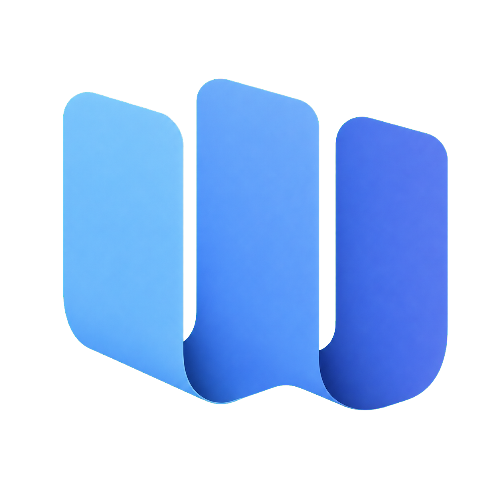
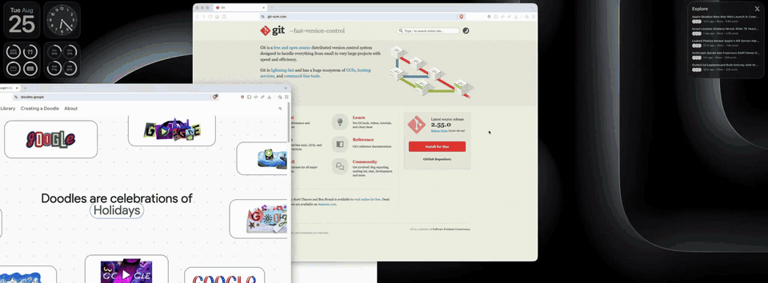

# Window Columns

<p align="center">
  
</p>

<p align="center">
  <a href="https://github.com/maskilx/window-columns/releases/download/v0.1.0-beta.2/Window-Columns-v0.1.0-beta.2-macos-arm64.zip">
    
  </a>
</p>

<p align="center">
  <sub>First launch: if Gatekeeper blocks this unnotarised beta, right-click the app and choose <strong>Open</strong>, or run <code>xattr -cr "/Applications/Window Columns.app"</code>.</sub>
</p>

[](CHANGELOG.md)
[](https://github.com/maskilx/window-columns/actions/workflows/ci.yml)
[](LICENSE)

A native macOS menu-bar app that arranges chosen windows as a connected set of
full-height columns, and gives each arrangement its own Dock and Command-Tab
entry so you can switch to a whole set of windows at once.

It uses the Accessibility API directly — no scripting bridge, no third-party
window manager, no background polling.

> **Public beta:** the current source release is **0.1.0-beta.2**. It is built
> and used on macOS 26 on Apple silicon, but has not yet been tested across the
> full macOS 13+ support range. Expect rough edges and please report them.



## What it does

Pick two or more windows in the chooser and they become a **group**: tiled
side by side as full-height columns across the display, filling it exactly.

Each group then gets its own coloured icon in the Dock and in Command-Tab.
Selecting that icon brings **every window in the group** to the front at once,
restoring their order, proportions and monitor — rather than raising one window
at a time.

- **Connected resizing** — drag the divider between two columns and the space is
  taken from its neighbour. Column widths always add up to the display.
- **Snap back** — drag a grouped window out of place and it returns on release.
  Drag it past another column's centre and the two swap.
- **Minimize a whole group** from its Dock menu, or a shortcut. Selecting the
  group's icon brings it all back.
- **Undo** an arrangement for two minutes afterwards, which puts every window
  back where it was and dismantles a group that was just created.
- Up to nine groups, each with its own colour and Command-Tab slot.

## Requirements

- macOS 13 or later
- Apple Command Line Tools (`xcode-select --install`) or Xcode

## Install the public beta

### Prebuilt beta

On an Apple silicon Mac, download
`Window-Columns-v0.1.0-beta.2-macos-arm64.zip` from the
[v0.1.0-beta.2 prerelease](https://github.com/maskilx/window-columns/releases/tag/v0.1.0-beta.2),
extract it, and move **Window Columns.app** to `/Applications`.

The prebuilt beta is arm64-only. Intel Mac users should build from source.

> [!IMPORTANT]
> **First launch: this beta is not notarised.** After moving the app to
> `/Applications`, bypass Gatekeeper using either of these methods:
>
> 1. In Finder, Control-click or right-click **Window Columns.app**, choose
>    **Open**, then confirm **Open**. This is only required on the first launch.
> 2. Alternatively, remove the downloaded app's quarantine attributes in
>    Terminal, then open it normally:
>
>    ```sh
>    xattr -cr "/Applications/Window Columns.app"
>    ```
>
> Only do this after downloading from the official release and verifying its
> SHA-256 checksum. The command recursively removes extended attributes from
> this app bundle.

The beta bundle is ad-hoc signed and **not notarised by Apple**. macOS will warn
the first time it opens. Review the source and attached SHA-256 checksum before
running it. Building from source remains the most transparent installation
path.

### Homebrew cask (draft)

The repository includes an arm64-only draft cask in
[`Casks/window-columns.rb`](Casks/window-columns.rb). Until a dedicated tap or
official Homebrew integration is available, install it directly from this
repository as a personal tap:

```sh
brew tap maskilx/window-columns https://github.com/maskilx/window-columns
brew install --cask maskilx/window-columns/window-columns
```

Homebrew installs **Window Columns.app** into `/Applications`. The downloaded
beta remains unnotarised, so follow the first-launch instructions above if
Gatekeeper blocks it. This cask is pinned to `v0.1.0-beta.1`; later releases
must update its version, URL and checksum before publication.

### Build from source

```sh
git clone https://github.com/maskilx/window-columns.git
cd window-columns
make signing-identity   # once — see "Why a signing identity" below
make run
```

`make run` builds, installs to `/Applications/Window Columns.app`, and launches
it. On first launch the chooser asks for Accessibility access; grant it in
**System Settings → Privacy & Security → Accessibility**.

macOS answers "am I trusted?" from a cache fixed when a process starts, so a
permission granted while the app is running cannot be seen by that process. The
app notices and restarts itself; if it does not, use **Quit & Reopen** on the
permission screen.

### Why a signing identity

`make signing-identity` creates a self-signed, code-signing-only certificate in
your login keychain. It needs no Apple Developer account and nothing leaves your
machine.

It matters because an ad-hoc signature has no certificate, so the app's
designated requirement is a bare hash of the binary:

```
designated => cdhash H"4254ff3d..."
```

macOS records that requirement when you grant Accessibility. Every rebuild
changes the hash, so the grant stops matching — while System Settings still
shows the switch turned on, because that row is keyed by bundle identifier. The
app appears to ignore a permission you already gave it. Signing with a
certificate makes the requirement reference the certificate instead, which is
identical for every future build.

Without the identity the build still works; `make install` then clears the stale
grant on each build and warns, so you get an honest prompt rather than a switch
that is on and does nothing.

## Using it

Click the menu-bar icon, or double-tap Control, to open the chooser.

| | |
|---|---|
| Type | Filter by window title or application |
| ↑ ↓ ← → | Move between windows |
| Return | Add or remove the focused window |
| ⌘Return | Arrange the selection |
| Escape | Clear the search, then close |

Position **1 is the rightmost column**; the strip above the grid draws the
arrangement you will get, at its real proportions.

Click a group's icons in the chooser to edit which windows belong to it. Click
its name to rename it — the name follows the group and shows on its Dock badge.

### Shortcuts

All of these are configurable in **Settings → Shortcuts**, including the
double-tap modifier. Click a shortcut to record a new one; Escape cancels and
Delete clears it.

| Default | Action |
|---|---|
| `⌃⌥⌘2` … `⌃⌥⌘9` | Arrange that many frontmost windows |
| `⌃⌥⌘Z` | Undo the last arrangement |
| `⌃⌥⌘M` | Minimize the active group |
| Double-tap `Control` | Open the chooser in "new group" mode |

There is deliberately no plain `⌘M` binding: registering that globally would
break Minimize in every application on the Mac.

## How it works

Three pieces:

- **The controller** (`Sources/WindowColumns`) is a menu-bar accessory app. It
  discovers windows through the Accessibility API, computes column frames, and
  writes them back.
- **The layout engine** (`Sources/WindowColumnsCore`) is pure logic with no
  AppKit dependency: column geometry, minimum-width handling, matching saved
  windows to live ones, and classifying how a window has drifted from its slot.
  This is the part with unit tests.
- **The companions** (`Sources/WindowColumnsGroupHost`) are tiny apps, one per
  group, that exist only to appear in the Dock and Command-Tab. Selecting one
  asks the controller to restore that group, then it steps aside.

Two macOS behaviours shape the design and are worth knowing if you work on it:

**Cooperative activation.** Since macOS 14 an application that is not frontmost
cannot simply activate another one. When you Command-Tab to a companion, the
*companion* holds activation, so it yields its activation right to the
controller and the controller also raises the group through the Accessibility
API, which is not subject to that restriction.

**Notifications are not enough.** Snapping back cannot rely on
`kAXWindowMovedNotification`, because Chromium and Electron windows and anything
with a custom title bar emit those unreliably or not at all during a drag. The
real window frames are read once per pointer release instead.

## Development

```sh
make build        # compile
make test         # core checks: layout, matching, displacement, fit, group state
make verify       # metadata validation, build, and core checks
make app          # build a staged .app under /private/tmp
make install      # build and install to /Applications
make run          # install and launch
make test-helper  # launch a real companion and check the Command-Tab handshake
make test-runtime # end-to-end checks against the installed, running app
```

`make test-runtime` drives the app you actually installed: it activates each
group the way Command-Tab does and verifies every member comes forward, that the
companion yields the foreground, and that the columns are full height, span the
usable area, and are separated by the configured gap.

`make reset-permission` clears stale Accessibility grants, including entries left
by earlier ad-hoc builds that still show as enabled but no longer match.

Group icons are generated by `Scripts/make-group-icons.py`, which needs Pillow
(`pip install Pillow`). You only need it if you change the icon artwork.

## Known limitations

- **Beta quality.** APIs, saved-state formats, and behaviour may still change
  before a stable 1.0 release.
- **Columns only.** Every window is full height; there is no row or grid mode.
- **One display per group.** A group is tiled on a single display. If that
  display is gone the group falls back to the current one.
- **Nine groups**, because there are nine pre-built companion bundles.
- **Not notarised.** The prebuilt beta is ad-hoc signed, not signed with an Apple
  Developer ID, and not notarised. macOS therefore shows a security warning.
- **Spaces.** Windows on another Space cannot be raised into the current one.
- Window thumbnails use `CGWindowListCreateImage`, which Apple marks obsolete as
  of macOS 15. It still works, but should move to ScreenCaptureKit.

## Contributing

Issues and pull requests are welcome. See [CONTRIBUTING.md](CONTRIBUTING.md) for
the development workflow and [CODE_OF_CONDUCT.md](CODE_OF_CONDUCT.md) for the
community expectations.

- [Report a bug](https://github.com/maskilx/window-columns/issues/new?template=bug_report.yml)
- [Request a feature](https://github.com/maskilx/window-columns/issues/new?template=feature_request.yml)
- Report security issues privately as described in [SECURITY.md](SECURITY.md).

Window Columns has no telemetry or network service. Its permission and local
data use are documented in [PRIVACY.md](PRIVACY.md).

Release history follows [Keep a Changelog](https://keepachangelog.com/) in
[CHANGELOG.md](CHANGELOG.md); the exact source release identifier is in
[VERSION](VERSION). Maintainer publication and release steps are documented in
[docs/PUBLISHING.md](docs/PUBLISHING.md) and
[docs/RELEASING.md](docs/RELEASING.md).

## License

MIT — see [LICENSE](LICENSE).
